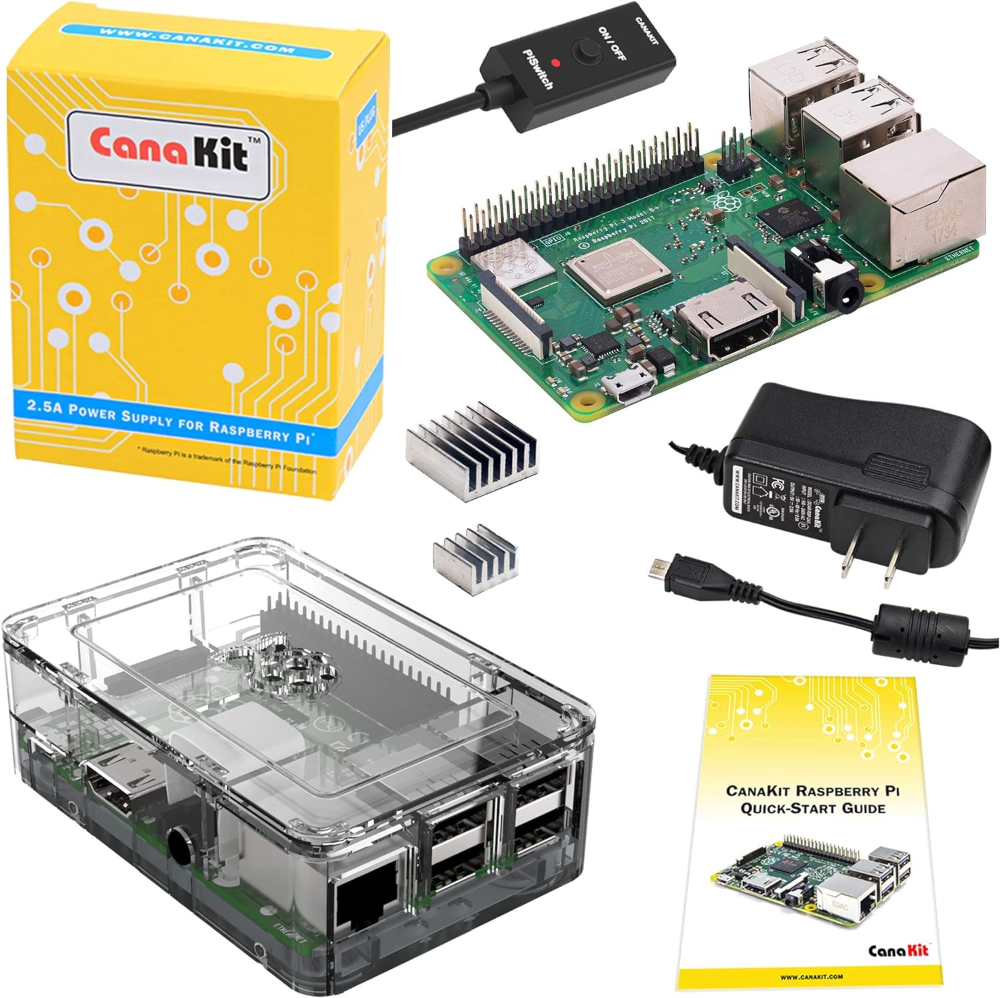
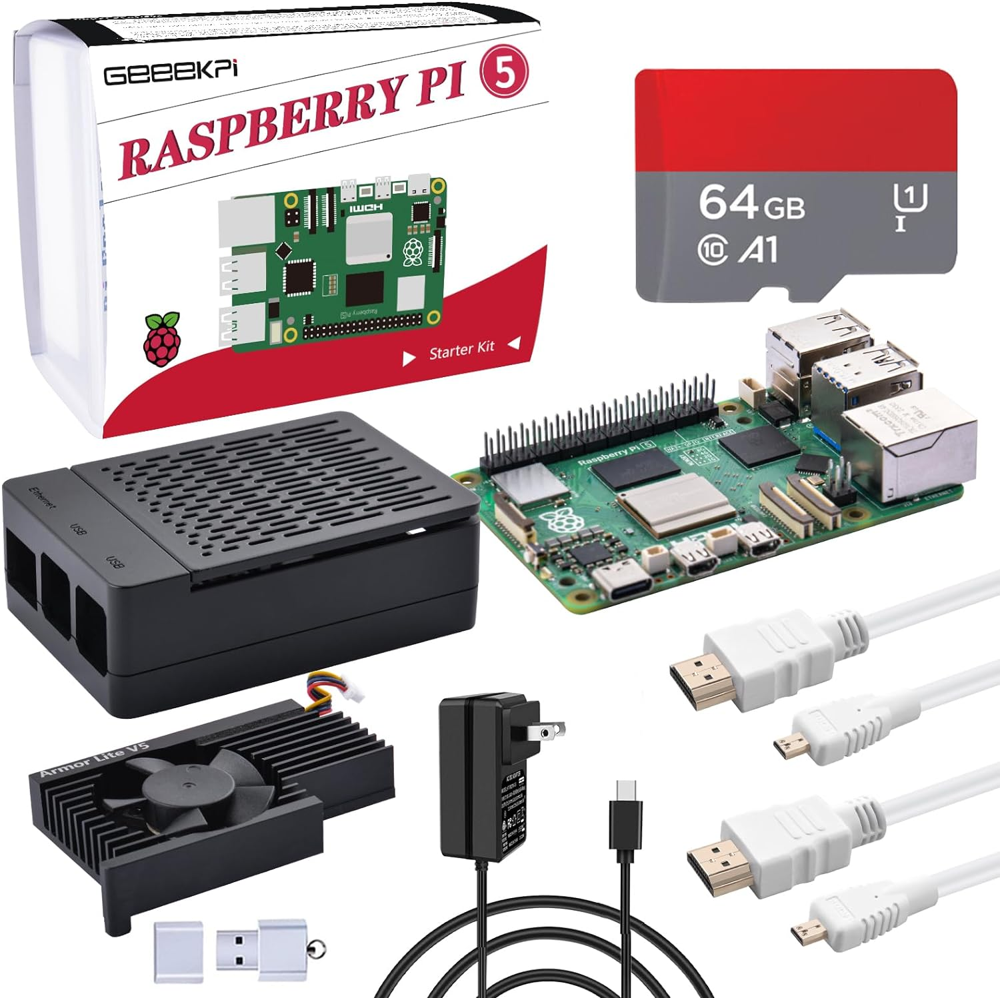
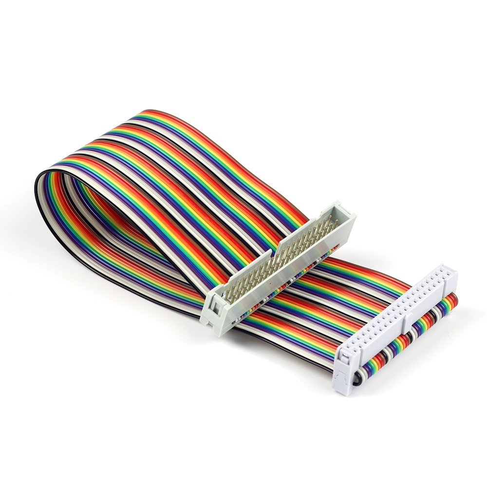
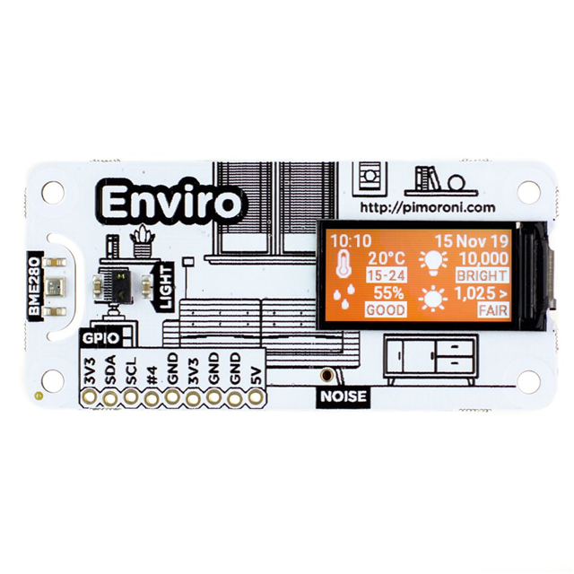
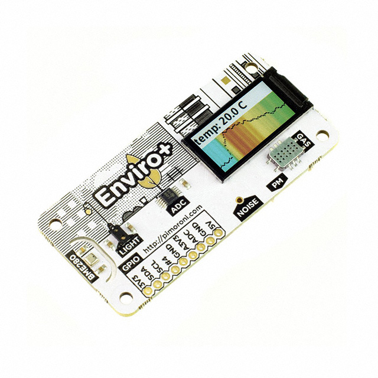
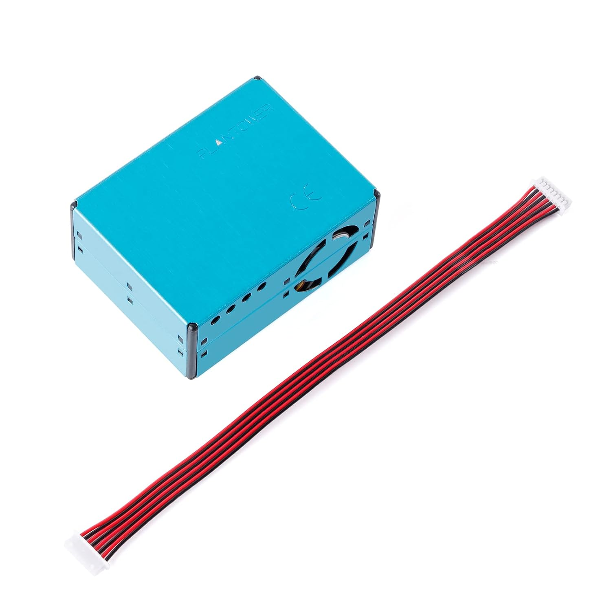
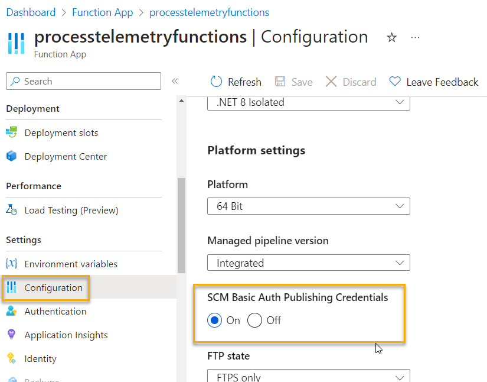
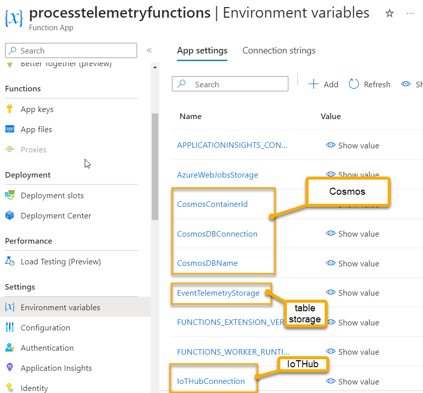
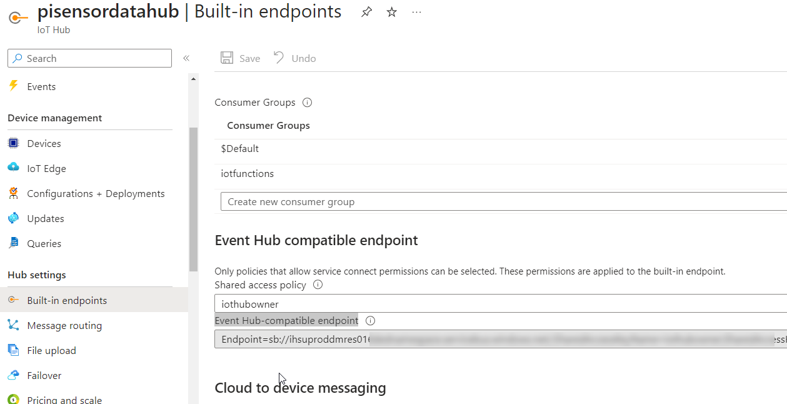
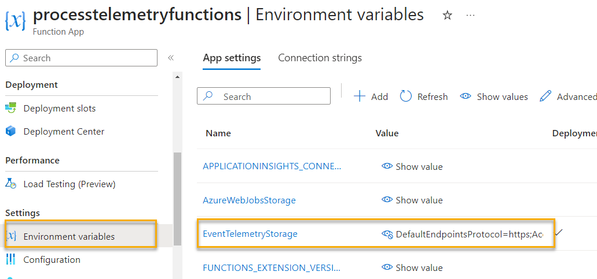

# Repository Overview

This repository contains two main projects: `DeviceCode` and `FunctionApp`. Below is a brief overview of each project, including their purpose, technology stack, and how to get started with them.


## Prerequisites

In order to use this, you need a PI3 or better, with both .NET and Python installed.  For live demonstrations, I use one or both of the following devices:

- Raspberry PI 3 [CanaKit Raspberry Pi 3 B+](https://www.amazon.com/CanaKit-Raspberry-Premium-Clear-Supply/dp/B07BC7BMHY/)

  

    - OS: RetroPie (Buster? or Stretch? not sure)

- Raspberry PI 5 [GeeekPi Starter Kit](https://www.amazon.com/dp/B0CQXJLHWJ?ref=ppx_yo2ov_dt_b_product_details&th=1)  

  

    - OS: Debian 12 (Bookworm) Full

### Get .NET on your Pi

[Get the installer script and install it](https://learn.microsoft.com/en-us/dotnet/core/install/linux-scripted-manual)  

```bash
wget https://dot.net/v1/dotnet-install.sh -O dotnet-install.sh
chmod +x ./dotnet-install.sh
./dotnet-install.sh --version latest
```  

### Make sure you have Python3 installed

```bash 
sudo apt-get update
sudo apt-get install python3
```   

### Get the Enviro pHAT library

[Get the Enviro(+) Library set up](https://learn.pimoroni.com/article/getting-started-with-enviro-plus#installing-the-enviro-python-library)    

```bash
git clone https://github.com/pimoroni/enviroplus-python
cd enviroplus-python
./install.sh
```  

### Hardware

1. Ribbons
    To connect the Enviro and Enviro+ I just use a ribbon cable to get it away from the heat of the CPU/Memory and so that it will actually connect to the board.

    I ordered 2 of these total:  

    [UCTRONICS Male to Female GPIO Ribbon Cable 40pin 8inch Breadboard Jumper Wires](https://www.amazon.com/dp/B07D991KMR?psc=1&ref=ppx_yo2ov_dt_b_product_details)  

      

1. Enviro Sensor [PIM486] -> no connection for PMS5003

    [Pimoroni Enviro](https://www.digikey.com/en/products/detail/pimoroni-ltd/PIM486/11205841?s=N4IgTCBcDaIAoEkCyAWAHANhAXQL5A)  
  
      

1. Enviro(+) Sensor [PIM458] -> Everything from PIM486 + connector for PMS5003

    [Pimoroni Enviro+](https://www.digikey.com/en/products/detail/pimoroni-ltd/PIM458/10289741)  

      

1. Plantower PMS 5003 -> Detect air particles

    [Plantower PMS5003](https://www.amazon.com/EC-Buying-Particle-Concentration-Precision/dp/B0B38J2836/)

      


### Technology Stack

- Python3
- .NET 8 C#
- Azure Functions (for live ingestion to the C# Function App which puts telemetry into Azure Table Storage)  
- Azure IoT Hub
- Azure Stream Analytics (for live ingestion to PowerBI dashboard or cosmos db)

### Azure IoT Hub

You will need to create an IoT Hub, add a device (or more) and then get the connection string for the device.  You can do this by following the steps below:

1. Create an IoT Hub

    [Create an IoT Hub](https://learn.microsoft.com/azure/iot-hub/iot-hub-create-through-portal?WT.mc_id=AZ-MVP-5004334)

1. Add a device

    [Add a device](https://learn.microsoft.com/azure/iot-hub/create-connect-device?WT.mc_id=AZ-MVP-5004334)

    >**Note:** For this demo I didn't use any certificates.  You will certainly want to use certrificates for production devices.

1. Get the connection string

    [Get the connection string](https://learn.microsoft.com/azure/iot-hub/create-connect-device?WT.mc_id=AZ-MVP-5004334&tabs=portal#retrieve-device-connection-string)  

### Azure Table Storage

Create an Azure storage account, then add a table storage to it.  Get the name of the table and the connection string for the azure storage account.  You will need these in the portal for the function app to connect to the storage account.

1. Create Azure Storage Account

    [Create an Azure Storage Account](https://learn.microsoft.com/azure/storage/common/storage-account-create?WT.mc_id=AZ-MVP-5004334)  

1. Add Table Storage

    [Add Table Storage](https://learn.microsoft.com/azure/storage/tables/table-storage-quickstart-portal?WT.mc_id=AZ-MVP-5004334)  

    Whatever you name the table, you will need to remember that name for the function app.

1. Retrieve the connection string

    [Get the connection string](https://learn.microsoft.com/azure/storage/common/storage-account-get-info?toc=%2Fazure%2Fstorage%2Fblobs%2Ftoc.json&bc=%2Fazure%2Fstorage%2Fblobs%2Fbreadcrumb%2Ftoc.json&tabs=portal&WT.mc_id=AZ-MVP-5004334#get-a-connection-string-for-the-storage-account)    

    You will need the connection string for the function app to connect to the storage account.

### Azure Cosmos DB

I added a cosmos db to try to visualize the data better using PowerBI and Azure Synapse Link

1. Create an Azure Cosmos DB

    [Create a FREE Cosmos DB](https://learn.microsoft.com/azure/cosmos-db/create-cosmosdb-resources-portal?WT.mc_id=AZ-MVP-5004334)

1. Create a database

    Keep track of what you named it

1. Create a container

    Keep track of what you named it

1. Get the connection string

    [Get the connection string](https://learn.microsoft.com/azure/cosmos-db/nosql/how-to-dotnet-get-started?WT.mc_id=AZ-MVP-5004334)  

    You will need the connection string for the function app to connect to the cosmos db.  You will also need the container name and the db name.


### Azure Function App

You will also need to create an azure function app (consumption is fine unless you need a network).  

1. Create an Azure Function App

    [Create an Azure Function App](https://learn.microsoft.com/azure/azure-functions/functions-create-first-azure-function?WT.mc_id=AZ-MVP-5004334)

1. Deploy the FunctionApp Code to the Azure Function App

    >**Note:** to publish without credentials and a pipeline you'll need to go to the function app configuration and enable `SCM Basic Auth Publishing Credentials` deployment.  Then you can use the `Publish` button in Visual Studio to publish the code to the function app.  

    


1. Add all the credentials

    - Cosmos DB Connection String
    - Storage Account Connection String
    - IoT Hub Connection String
    - Table Name for the Storage Account
    - Cosmos DB Database Name
    - Cosmos DB Container Name

      

## DeviceCode App

Device code is used to run on the PI device to create and publish telemetry readings to Azure.

### Overview

Make sure to have everything connected and all the libraries in place. Make sure you've cloned the repo and at least have the DeviceCode project on the PI.  You can run the following commands to get the code on the PI:

Before running the project, make sure to instantiate your python `venv` so that the pimoroni controls are available.  You can do this by running the following commands:

```bash
cd DeviceCode
cd IotSensorReadingsFromPiToAzure
source ensurepython.sh
```  

### Make sure you have the correct user secrets in place

You will likely need to make this manually on the Pi.

```bash
cd ~
mkdir .microsoft
cd .microsoft
mkdir usersecrets
cd usersecrets
mkdir a213f400-a0fd-4e12-af02-19bab43552d6
cd a213f400-a0fd-4e12-af02-19bab43552d6
touch secrets.json
nano secrets.json
```

In the file, add the device id and connection string to the IoT Hub

```json  
{
  "DeviceId": "your-device-id",
  "ConnectionString": "your-connection-string"
}
```

### Run the application

Navigate to the DeviceCode directory and then drill to the project level under IoTSensorReadingsFromPiToAzure.  Then run the following command:

```bash
dotnet run
```  

Specify your duration to collect telemetry

## FunctionApp

The function app is configured to respond to an event grid trigger.  Since IoT Hub is a subset of event grid, this is not a problem.

>**Note:** You will need to use the connection string for the Event Grid Endpoint from the IoT Hub for this to work.

1. Create the function app

    [Create the function app](https://learn.microsoft.com/azure/azure-functions/functions-create-function-app-portal?pivots=programming-language-csharp&WT.mc_id=AZ-MVP-5004334#create-a-function-app)  

1. Enable SCM Deployment (see above)  

1. Deploy the function app

    Use Visual Studio to publish the function app to the Azure Function App.  

1. Add connection information for the IoTHub

    Add a configuration variable to leverage the connection to the IoTHub

    Navigate to the Hub -> Built-in endpoints and get the connection string for the `Event Hub-compatible endpoint`  

    

    Add this to the configuration settings for the function app.

1. Add connection information for the storage account

     


### Technology Stack

- C# .NET 8 - Isolated Azure Function App
- EventHub Trigger on the function
- Leverages user.secret for the connection string to the storage account

---

## Slides

You can view the slides [for presenting this repo here](https://training.majorguidancesolutions.com/courses/blog-posts-and-talks/contents/667e71d82ef93)

## Conclusion

With everything in place and the project(s) running you should be collecting telemetry data, processing with a function app, and pushing the event data to table storage.